# Table of contents
1. [Project description](#1-project-description)  
2. [Results and learnings](#2-results-and-learnings)  
    2.1. [Main challenge and initial assumptions](#21-main-challenge-and-initial-assumptions)  
    2.2. [Dataset](#22-dataset)  
    2.3. [Training and evaluation results](#23-training-and-evaluation-results)    
    2.4. [Model deployment and usage](#24-model-deployment-and-usage)
3. [Run the example](#3-run-the-example)  
    3.1. [Prerequisites](#31-prerequisites)  
    3.2. [Train and evaluate the model](#32-train-and-evaluate-the-model)  
    3.3. [Deploy web service](#33-deploy-web-service)
4. [Code highlights](#4-code-highlights)  

<br>

# 1. Project description 
[[back to the top]](#table-of-contents)

This case study shows how to create a model for **text analysis and classification** and deploy it as a **web service in Azure cloud** in order to automatically **classify support tickets**.<br>
This project is a proof of concept made by Microsoft (Commercial Software Engineering team) in collaboration with [Endava](http://endava.com/en).<br>
Our combined team tried 3 different approaches to tackle this challenge using:
- [Azure Machine Learning Studio](https://studio.azureml.net/) - drag-and-drop machine learning tools
- [Microsoft Cognitive Toolkit (CNTK)](https://github.com/Microsoft/CNTK) - deep neural networks framework
- [Azure Machine Learning service](https://docs.microsoft.com/azure/machine-learning/service) - with Python and classic machine learning algorithms

In this repository we will focus only on AML Workbench and Python scripts used to solve this challenge.


#### What will you find inside:     #### 
- How to clean and prepare text data and featurize it to make it valuable for machine learning scenarios
- How to strip the data from any sensitive information and also anonymize/encrypt it
- How to create a classification model using Python modules like: [sklearn](http://scikit-learn.org/stable/), [nltk](https://www.nltk.org/), [matplotlib](https://matplotlib.org/), [pandas](https://pandas.pydata.org/)
- How to create a web service with a trained model and deploy it to Azure
- How to leverage [Azure Machine Learning Service](https://azure.microsoft.com/en-us/services/machine-learning-services/) to make working on ML projects easier, faster and much more efficient


#### The team: ####
- [Karol Żak](https://twitter.com/karolzak13) ([GitHub](https://github.com/karolzak)) - Software Development Engineer, Microsoft
- [Filip Glavota](https://twitter.com/fglavota) - Software Development Engineer, Microsoft
- [Ionut Mironica](https://www.linkedin.com/in/ionut-mironica-06b35a2a/) ([GitHub](https://github.com/imironica)) - Senior Developer, Endava 
- [Bogdan Dinu](https://www.linkedin.com/in/bogdanvdinu) - Senior Development Consultant, Endava
- [Bogdan Marin](www.linkedin.com/in/bogdanmmarin) ([GitHub](https://github.com/bogdanm-marin)) - Senior Developer, Endava 
- [Florin Vinca](https://www.linkedin.com/in/vinca-florin-442ba229/) - Senior Developer, Endava
- Ioana Raducanu - BI Analyst Developer, Endava
- [Andreea Tipau](https://www.linkedin.com/in/andreea-tipau-309aa1124/) - Developer, Endava


<br>

# 2. Results and learnings
[[back to the top]](#table-of-contents)

***Disclaimer:***
*This POC and all the learnings you can find below is an outcome of close cooperation between Microsoft and [Endava](http://endava.com/en). Our combined team spent total of 3 days in order to solve a challenge of automatic support tickets classification.*


## 2.1. Main challenge and initial assumptions ##
[[back to the top]](#table-of-contents)

- Main challenge we tried to solve was to create a model for automatic support tickets classification for Endavas helpdesk solution. As Endava stated: currently helpdesk operators waste a lot of time evaluating tickets and trying to assign values to properties like: `ticket_type, urgency, impact, category, etc.` for each submitted ticket
- The dataset we used is Endavas internal data imported from their helpdesk system. We were able to collect around 50k classified support tickets with original messages from users and already assigned labels
- In our POC we focused only on tickets submited in form of an email, similar to the one below:


<br>

## 2.2. Dataset ##    
[[back to the top]](#table-of-contents)

- For the sake of this repository, data have been stripped out of any sensitive information and anonymized (encrypted). In the original solution we worked on a full dataset without any encryptions. You can download anonymized dataset from [here](https://privdatastorage.blob.core.windows.net/github/support-tickets-classification/datasets/all_tickets.csv).

- Example of anonymized and preprocessed data from [AML Workbench](https://docs.microsoft.com/en-us/azure/machine-learning/preview/quickstart-installation) view:  


- AML Workbench gives some [powerfull and easy to use tools for data preparation](https://docs.microsoft.com/en-us/azure/machine-learning/preview/tutorial-bikeshare-dataprep). And below you can see a sample data transformation flow we used while preparing our dataset:  
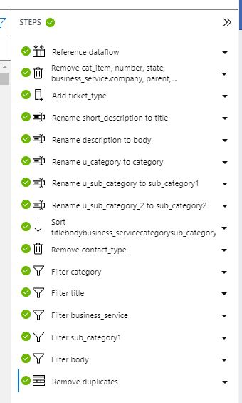

- After evaluating the data in AML Workbench we quickly discovered that distribution of values for most of columns we wanted to classify is strongly unbalanced with some of the unique values represented by even as low as 1-2 samples. There are [multiple techniques](https://shiring.github.io/machine_learning/2017/04/02/unbalanced) to deal with that kind of issues but due to limited amount of time for this POC we were not able to test them in action.   

- Distribution of values for each column:  

    ticket_type   |  business_service
    :-------------------------:|:-------------------------:
     |  

    impact   |  urgency 
    :-------------------------:|:-------------------------:
    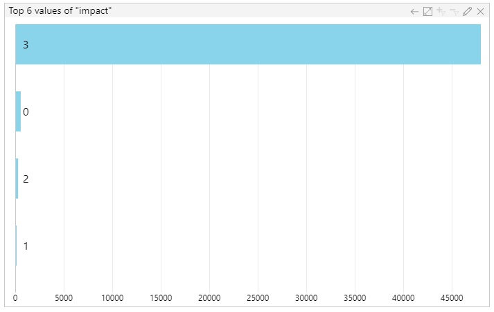 | 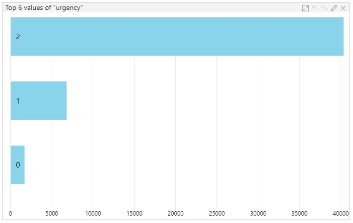 

    category   |  sub_category1
    :-------------------------:|:-------------------------:
     | 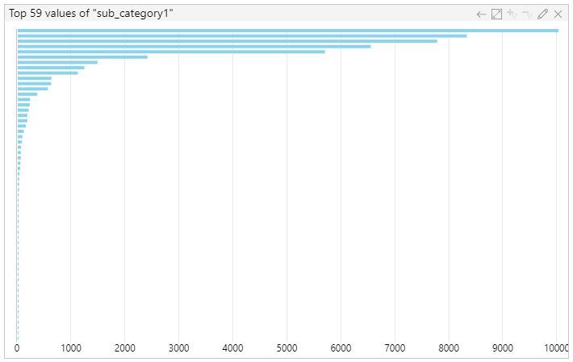

    sub_category2   |  
    :-------------------------:|
     |


<br>

## 2.3. Training and evaluation results ##
[[back to the top]](#table-of-contents)

In order to train our models, we used [AML Workbench](https://docs.microsoft.com/en-us/azure/machine-learning/preview/quickstart-installation) and [Azure Machine Learning Services](https://azure.microsoft.com/en-us/services/machine-learning-services/) to run training jobs with different parameters and then compare the results and pick up the one with the best values.:


To train models we tested 2 different algorithms: [SVM](http://scikit-learn.org/stable/modules/generated/sklearn.linear_model.SGDClassifier.html) and [Naive Bayes](http://scikit-learn.org/stable/modules/naive_bayes.html#multinomial-naive-bayes). In both cases results were pretty similar but for some of the models, Naive Bayes performed much better (especially after applying [hyperparameters](https://en.wikipedia.org/wiki/Hyperparameter)) so at some point we decided to work with NB only.    

Below you can find some of the results of models we trained to predict different properties:

- ### **`ticket_type`** ###    
    We started from predicting the least unbalanced (and most important from Endavas business point of view) parameter which is `ticket_type` and after training the model and finding the best hyperparameters using [GridSearchCV](http://scikit-learn.org/stable/modules/generated/sklearn.model_selection.GridSearchCV.html) (which improved precision and recall by around 4%), we were able to achieve some really good results which you can see below:

    | confusion matrix for `ticket_type` | metrics for `ticket_type` |
    :-------------------------:|:-------------------------:
    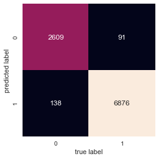 | 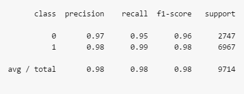

- ### **`business_service`** ###

    `business_service` property is one of the unbalanced features with very low amount of samples/per class for most values.    
    We started from running the training on a subset of our dataset where we removed `business_service` values which were represented by less then 100 samples.    
    Unfortunately that didn't help much and we still had a lot of classes that were not at all recognized. So we continued to increase the minimum required number of samples per class untill we started to see some meaningful results:

    
    | confusion matrix for `business_service` | metrics for `business_service` |
    :-------------------------:|:-------------------------:
     | 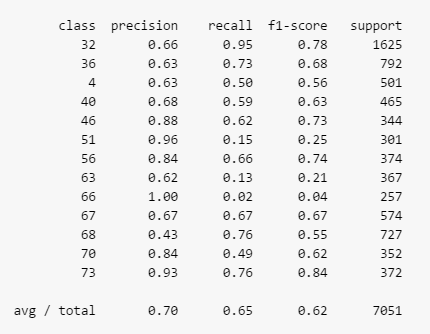

- ### **`category`, `impact` and `urgency`** ###

    To predict `category`, `impact` and `urgency` we took the same approach as with `business_service` property but results looked even worse. It's obvious that such level of unbalance within the data makes it impossible to create a model with any meaningful results.    
    If you would only look at mean/average value of `precision` and `recall` you could wrongly assume that results are quite well but if you would check the values of `support` for each class it would become clear that because one class which covers 70-90% of our data, the results are completely rigged:
    
    | confusion matrix for `category` | metrics for `category` |
    :-------------------------:|:-------------------------:
     | 
    
    | confusion matrix for `impact` | metrics for `impact` |
    :-------------------------:|:-------------------------:
    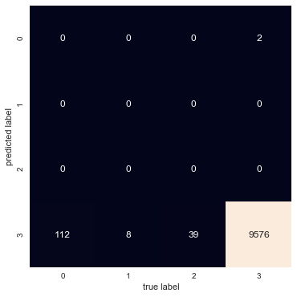 | 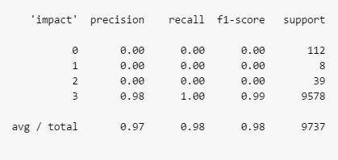
    
    | confusion matrix for `urgency` | metrics for `urgency` |
    :-------------------------:|:-------------------------:
    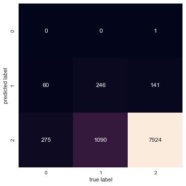 | 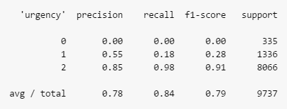


<br>

## 2.4. Model deployment and usage ##
[[back to the top]](#table-of-contents)

Final model will be used in form of a web service running on Azure and that's why we prepared a sample RESTful web service written in Python and using [Flask module](http://flask.pocoo.org/). This web service makes use of our trained model and provides API which accepts email body (text) and returns predicted properties.

You can find a running web service hosted on [Azure Web Apps](https://docs.microsoft.com/en-us/azure/app-service/app-service-web-overview) here: https://endavaclassifiertest1.azurewebsites.net/.    
The project we based our service on with code and all the deployment scripts can be found here: [karolzak/CNTK-Python-Web-Service-on-Azure](https://github.com/karolzak/CNTK-Python-Web-Service-on-Azure).

*Sample request and response in Postman:*


<br>

# 3. Run the example
## 3.1. Prerequisites
[[back to the top]](#table-of-contents)


- **Download content of this repo**

    You can either clone this repo or just download it and unzip to some folder

- **Setup Python environment**

    In order to run scripts from this repo you should have a proper Python environment setup. If you don't want to setup it locally you can use one of the [Data Science Virtual Machine](https://azure.microsoft.com/en-us/services/virtual-machines/data-science-virtual-machines/) images (both on [Linux](https://azuremarketplace.microsoft.com/marketplace/apps/microsoft-ads.linux-data-science-vm-ubuntu) and [Windows](https://azuremarketplace.microsoft.com/marketplace/apps/microsoft-ads.windows-data-science-vm)) on Azure. All of them come in with most popular data science and machine learning tools and frameworks already preinstalled and ready for you.

- **Install dependencies**

    Make sure to install all the dependencies for this project. You can easily do it by using [requirements.txt](requirements.txt) file and running this command:

    ```cmd
    pip install -r requirements.txt
    ```
    Please report issues if you find any errors or missing modules, thanks!

- **Download Endava support tickets dataset (all_tickets.csv)**

    You can download the dataset from [here](https://privdatastorage.blob.core.windows.net/github/support-tickets-classification/datasets/all_tickets.csv) or by executing [1_download_dataset.py](1_download_dataset.py) script. If you decide to download it manually, just make sure to put it under:
    ```
    project
    └───datasets
        └───all_tickets.csv
    ```
    Endavas support tickets dataset is already cleaned and stripped out of any unnecessary words and characters. You can check some of the preprocessing operations that were used in [0_preprocess_data.py](0_preprocess_data.py) script.

    
## 3.2. Train and evaluate the model
[[back to the top]](#table-of-contents)

To train the model you need to run [2_train_and_eval_model.py](2_train_and_eval_model.py) script. There are some parameters you could possibly play around with - check out [code highlights section](#4-code-highlights) for more info.

## 3.3. Deploy web service
[[back to the top]](#table-of-contents)

Inside [webservice](webservice) folder you can find scripts to setup a Python based RESTful web service (made with Flask module).

Deeper in that folder you can also find [download_models.py](webservice/models/download_models.py) script which can be used to download some already trained models that will be used by the web service app.

In order to deploy it to an environment like [Azure App Service](https://azure.microsoft.com/en-us/services/app-service/) you can check [this GitHub repo](https://github.com/karolzak/CNTK-Python-Web-Service-on-Azure) for some inspiration.

<br>

# 4. Code highlights
[[back to the top]](#table-of-contents)

- [0_preprocess_data.py](0_preprocess_data.py) - collection of scripts we used for data preprocessing and anonymization. I attached it in case someone would be interested in steps we followed with our data

    In order to clean our data we removed:
    - headers and footers
    - email metadata (like: from, to, cc, date, etc.)
    - email addresses, phone numbers and urls
    - image references
    - blacklisted words (Endavas sensitive information)
    - non-english words - few percent of emails contained Romanian language
    - all numerical values
    - all non-alphabetic characters
    - whitespaces

    In order to anonymize the dataset for publishing purposes we used [sklearn.preprocessing.LabelEncoder](http://scikit-learn.org/stable/modules/generated/sklearn.preprocessing.LabelEncoder.html):
    
    ```Python    
    def encryptSingleColumn(data):
        le = preprocessing.LabelEncoder()
        le.fit(data)
        return le.transform(data)


    def encryptColumnsCollection(data, columnsToEncrypt):
        for column in columnsToEncrypt:
            data[column] = encryptSingleColumn(data[column])
        return data
    ```

- [1_download_dataset.py](1_download_dataset.py) - simple script used to download our dataset (already preprocessed, cleaned and anonymized)

- [2_train_and_eval_model.py](2_train_and_eval_model.py) - 

    - `column_to_predict` variable is used to determine which column should be used for classification

        ```Python                
        column_to_predict = "ticket_type"
        # Supported datasets:
        # ticket_type
        # business_service
        # category
        # impact
        # urgency
        # sub_category1
        # sub_category2
        ```

    - You can play around with some variables in order to improve accuracy:
    
        ```Python
        classifier = "NB"  # Supported algorithms: "SVM" and "NB"
        use_grid_search = False  # grid search is used to find hyperparameters. Searching for hyperparameters is time consuming
        remove_stop_words = True  # removes stop words from processed text
        stop_words_lang = 'english'  # used with 'remove_stop_words' and defines language of stop words collection
        use_stemming = False  # word stemming using nltk
        fit_prior = True  # if use_stemming == True then it should be set to False ?? double check
        min_data_per_class = 1  # used to determine number of samples required for each class. Classes with less than that will be excluded from the dataset. Default value is 1
        ```
    
    - Loading dataset into [pandas.DataFrame](https://pandas.pydata.org/pandas-docs/stable/generated/pandas.DataFrame.html) object:

        ```Python                
        # loading dataset from dprep in Workbench    
        # dfTickets = package.run('AllTickets.dprep', dataflow_idx=0) 
        
        # loading dataset from csv
        dfTickets = pd.read_csv(
            './datasets/all_tickets.csv',
            dtype=str
        )  
        ```
        
    - Splitting dataset using [sklearn.model_selection.train_test_split](http://scikit-learn.org/stable/modules/generated/sklearn.model_selection.train_test_split.html):

        ```Python      
        # Split dataset into training and testing data
        train_data, test_data, train_labels, test_labels = train_test_split(
            data, labelData, test_size=0.2
        )  # split data to train/test sets with 80:20 ratio
        ```
        
    - You can use one of 3 different count vectorizers for features extraction from text:

        ```Python                
        # Extracting features from text
        # Count vectorizer
        if remove_stop_words:
            count_vect = CountVectorizer(stop_words=stop_words_lang)
        elif use_stemming:
            count_vect = StemmedCountVectorizer(stop_words=stop_words_lang)
        else:
            count_vect = CountVectorizer()
        ```
        
    - Creating a [Pipeline](http://scikit-learn.org/stable/modules/generated/sklearn.pipeline.Pipeline.html) to organize transforms and final estimator and fitting the dataset into it:

        ```Python                
        text_clf = Pipeline([
            ('vect', count_vect),
            ('tfidf', TfidfTransformer()),
            ('clf', MultinomialNB(fit_prior=fit_prior))
        ])
        text_clf = text_clf.fit(train_data, train_labels)
        ```

    - [sklearn.model_selection.GridSearchCV](http://scikit-learn.org/stable/modules/generated/sklearn.model_selection.GridSearchCV.html) can be used to search for best possible set of parameters for the learning algorithm:

        ```Python                
        if use_grid_search:
            # Grid Search
            # Here, we are creating a list of parameters for which we would like to do performance tuning.
            # All the parameters name start with the classifier name (remember the arbitrary name we gave).
            # E.g. vect__ngram_range; here we are telling to use unigram and bigrams and choose the one which is optimal.
            
            # NB parameters
            parameters = {
                'vect__ngram_range': [(1, 1), (1, 2)],
                'tfidf__use_idf': (True, False),
                'clf__alpha': (1e-2, 1e-3)
            }

            # SVM parameters
            #    'vect__max_df': (0.5, 0.75, 1.0),
            #    'vect__max_features': (None, 5000, 10000, 50000),
            #    'vect__ngram_range': ((1, 1), (1, 2)),  # unigrams or bigrams
            #    'tfidf__use_idf': (True, False),
            #    'tfidf__norm': ('l1', 'l2'),
            #    'clf__alpha': (0.00001, 0.000001),
            #    'clf__penalty': ('l2', 'elasticnet'),
            #    'clf__n_iter': (10, 50, 80),
            # }

            # Next, we create an instance of the grid search by passing the classifier, parameters
            # and n_jobs=-1 which tells to use multiple cores from user machine.
            gs_clf = GridSearchCV(text_clf, parameters, n_jobs=-1)
            gs_clf = gs_clf.fit(train_data, train_labels)

            # To see the best mean score and the params, run the following code
            gs_clf.best_score_
            gs_clf.best_params_
        ```
        
    - Predicting labels for test set, evaluating accuracy of the model (with and without GridSearch) and printing out a simple [confusion matrix](http://scikit-learn.org/stable/modules/generated/sklearn.metrics.confusion_matrix.html):

        ```Python                
        print("Evaluating model")
        # Score and evaluate model on test data using model without hyperparameter tuning
        predicted = text_clf.predict(test_data)
        prediction_acc = np.mean(predicted == test_labels)
        print("Confusion matrix without GridSearch:")
        print(metrics.confusion_matrix(test_labels, predicted))
        print("Mean without GridSearch: " + str(prediction_acc))

        # Score and evaluate model on test data using model WITH hyperparameter tuning
        if use_grid_search:
            predicted = gs_clf.predict(test_data)
            prediction_acc = np.mean(predicted == test_labels)
            print("Confusion matrix with GridSearch:")
            print(metrics.confusion_matrix(test_labels, predicted))
            print("Mean with GridSearch: " + str(prediction_acc))
        ```
        
    - Plotting confusion matrix using `heatmap` from [seaborn](https://seaborn.pydata.org/generated/seaborn.heatmap.html) module:

        ```Python                
        # Ploting confusion matrix with 'seaborn' module
        # Use below line only with Jupyter Notebook
        # %matplotlib inline
        import seaborn as sns
        from sklearn.metrics import confusion_matrix
        import matplotlib.pyplot as plt
        import matplotlib
        mat = confusion_matrix(test_labels, predicted)
        plt.figure(figsize=(4, 4))
        sns.set()
        sns.heatmap(mat.T, square=True, annot=True, fmt='d', cbar=False,
                    xticklabels=np.unique(test_labels),
                    yticklabels=np.unique(test_labels))
        plt.xlabel('true label')
        plt.ylabel('predicted label')
        # Save confusion matrix to outputs in Workbench
        # plt.savefig(os.path.join('.', 'outputs', 'confusion_matrix.png'))
        plt.show()
        ```

        Resulting confusion matrix should look similar to this:    
                
        
    - Printing out [classification report](http://scikit-learn.org/stable/modules/generated/sklearn.metrics.classification_report.html):

        ```Python                
        # Printing classification report
        # Use below line only with Jupyter Notebook
        from sklearn.metrics import classification_report
        print(classification_report(test_labels, predicted,
                                    target_names=np.unique(test_labels)))
        ```
        
        Resulting classification report should look similar to this:   
        
    
    - Serializing trained models using [pickle](https://docs.python.org/3/library/pickle.html#module-pickle) module:

        ```Python                
        # Save trained models to /output folder
        # Use with Workbench
        if use_grid_search:
            pickle.dump(
                gs_clf,
                open(os.path.join(
                    '.', 'outputs', column_to_predict+".model"),
                    'wb'
                )
            )
        else:
            pickle.dump(
                text_clf,
                open(os.path.join(
                    '.', 'outputs', column_to_predict+".model"),
                    'wb'
                )
            )
        ```

- [webservice.py](webservice/webservice.py) - 

    - Loading pretrained models from serialized files using pickle:

        ```Python
        model_ticket_type = pickle.load(
            open(
                os.path.join(__location__, "ticket_type.model"), "rb"
            )
        )
        ```

    - Extracting `description` text from requests json, fitting it into the model to get a prediction and returning the result as json:

        ```Python        
        @app.route('/endava/api/v1.0/tickettype', methods=['POST'])
        def tickettype():
            ts = time.gmtime()
            logging.info("Request received - %s" % time.strftime("%Y-%m-%d %H:%M:%S", ts))
            print(request)
            print(request.json)
            if not request.json or 'description' not in request.json:
                abort(400)
            description = request.json['description']
            print(description)

            predicted = model_ticket_type.predict([description])
            print("Predicted: " + str(predicted))

            ts = time.gmtime()
            logging.info("Request sent to evaluation - %s" % time.strftime("%Y-%m-%d %H:%M:%S", ts))
            return jsonify({"ticket_type": predicted[0]})
        ```
